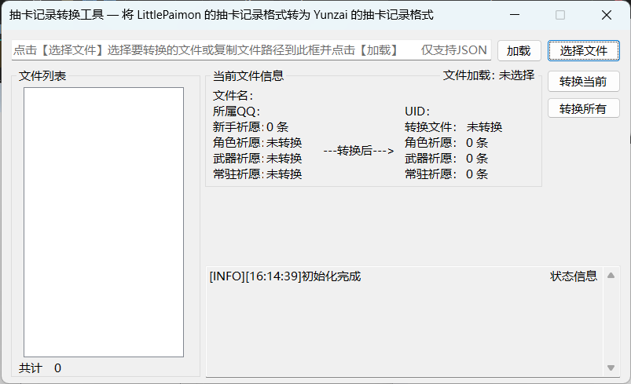

# GachaWishExportTransform

**额，初学练手，还望海涵。如果有问题请多提 issue，有能力会继续填坑**

## 需要 ==.Net 6.0==框架/运行时 才支持运行本程序

## 1 简要介绍

### 1.1 操作流程

① 打开软件。
② 点击 ==**选择文件**== 选择需要转换的文件，可多选。或者将需要转换的单个文件的 **绝对路径** 粘贴到顶栏并点击 ==**加载**== 将文件路径保存到列表。
③ 文件列表会列出即将要进行转换的文件。此时，可以双击列表中的文件以加载文件内容，可以获得文件中的一些信息，例如右侧所列出的 **QQ号，UID以及祈愿信息**。想转换<u>单个文件</u>可在左侧的 **文件列表** 中选中文件后点击右侧按钮 ==**转换当前**== 来转换单个文件；批量转换在导入文件路径后就可直接点击 ==**转换所有**== 来转换。
④ 转换完成后。程序会在程序所在目录生成文件夹 **FileOutput** 。会按照云崽需要的格式创建文件夹并生成相应文件，此外，由于我暂时没看到云崽怎么处理的新手祈愿~~（就是没记录到）~~，因此先把这部分记录和一些没处理到的数据保存在一个新的文件 **Others.json** 中。

### 1.2 注意事项

此外，几乎所有的行为都会在 ==**状态信息**== 被展示。你可以看到一些没有处理成功的文件的错误原因。（如果有意外的报错可以联系我补充进去~~，不过没人用就是了~~）

转换后的文件信息只能在转换了文件以后查看，因此想看某个文件转换后的祈愿数量也只能先==转换当前==了。

## 2 最后

​		首先希望月佬大大不要打我。(/▽＼)我是被迫的。我的gocq不知道为什么用光了办法也登不上去了，人都傻了。群里还有好十几个小伙伴，~~还有群主在催~~。迫不得已只能转云崽用了。但是现在感觉云崽没有nonebot那么多小插件，确实不好用。~~（而且也不会写）~~以后还是Python好用。嗯对。
